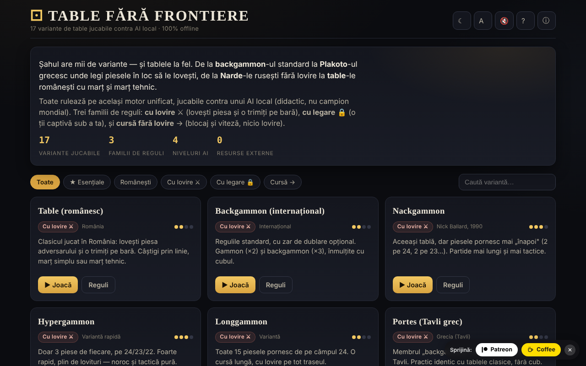

# Table fără frontiere

17 variante de table jucabile contra unui AI local, într-un singur fișier HTML.

**Live:** https://chiuta.github.io/Table-fara-frontiere/

## Ce este

Un atlas jucabil al familiei de jocuri „table”: backgammon occidental, Tavli grecesc (Portes, Plakoto, Fevga), Tavla turcească, Tapa bulgărească, Narde rusești, Gul Bara și variante românești cu marț și marț tehnic. Toate rulează pe același motor de joc, cu trei familii de reguli: cu lovire ⚔, cu legare 🔒 și cursă fără lovire →. Adversarul este un AI local, cu rol didactic, nu un motor de turneu.

## Funcții

- 17 variante, între care: Table (românesc), Backgammon (internațional), Nackgammon, Hypergammon, Longgammon, Portes, Tavla, Acey-Deucey, Backgammon rusesc, Plakoto, Tapa, Moultezim / Mahbusa, Fevga, Narde / Table lungi, Gul Bara, Table pe duse (românești, lungi), Table de pierdut (Misère).
- Filtre în atlas: Toate, ★ Esențiale, Românești, Cu lovire, Cu legare, Cursă.
- AI cu patru niveluri: Începător, Mediu, Avansat, Expert (funcție de evaluare, plus căutare expectimax de 1 ply la nivelurile superioare, după descrierea din aplicație).
- Zar de dublare (opțional, cu propunere de dublare din partea AI-ului), scor pe partide, calcul de marț pentru variantele românești.
- Butoane: **Aruncă zarurile**, **↶ Înapoi**, **Sugestie**, **✓ Termină tura**, **Joc nou**, **Reguli**.
- Temă (☾), mărime text (A), sunet (🔇), ajutor (?) și „Despre acest atlas” (ⓘ).
- Aproximările de reguli sunt marcate pe cartonașul variantei cu „⚠ aproximare”.

## Manual de utilizare

1. Alege o variantă din atlas (sau filtrează după familie) și apasă **▶ Joacă această variantă**.
2. Joci cu piesele albe (●), AI-ul cu cele negre (○). Apasă **Aruncă zarurile**; la o dublă ai patru mutări.
3. Atinge o piesă proprie, apoi câmpul-țintă evidențiat; pentru a scoate o piesă, atinge zona „Scoase”.
4. **↶ Înapoi** anulează ultima mutare din tură; **✓ Termină tura** încheie tura.
5. Din „Reglaje” alegi nivelul AI și, dacă vrei, zarul de dublare.
6. Scurtături de tastatură: **R** aruncă zarurile, **U** înapoi, **Enter** termină tura, **H** sugestie, **N** joc nou, **T** temă, **A** text, **Esc** înapoi / închide.
7. **← Atlas** te întoarce la lista de variante.

## Confidențialitate și rețea

- **Stocare locală (localStorage):** o singură cheie, `tff`, cu preferințele tale: temă, mărime text, sunet, nivel AI și opțiunea zarului de dublare.
- **Rețea:** aplicația nu face cereri de rețea și nu încarcă resurse externe. Linkurile Patreon și Buy Me a Coffee se deschid doar la clic. Fără telemetrie.

## Rulare locală / offline

Descarcă `index.html` și deschide-l în browser; funcționează fără internet.

## Licență

Licența nu este încă declarată explicit în acest repository; vezi nota din aplicație.

Fereastra „Despre acest atlas” spune: „Cod liber pentru uz educațional, CC-BY-SA 4.0.” Antetul fișierului conține însă o mențiune CC0; cele două urmează să fie clarificate.

## Audit

Audit: 2026-10-10 — verificat cu Playwright și axe-core (WCAG 2.1 AA, ambele teme); verificat în cod: fără `fetch`/CDN, CSP strict (`default-src 'self'`). Corectate: contrast pe filtrul activ în tema luminoasă, checkbox decorativ focalizabil.

## Autor

Alexio — Alexandru-Ionuț Chiuță, Centrul StrING (după cum este menționat în aplicație). Contact: alexio@trom.tf

## English summary

Table fără frontiere is a single-file atlas of 17 backgammon-family games (Western backgammon, Greek Tavli, Turkish Tavla, Narde, Romanian table variants and more) playable against a local, educational AI with four difficulty levels, on one unified rules engine. Keyboard shortcuts are provided; only preferences are stored in localStorage and no network requests are made. UI in Romanian. License not yet declared (the app text mentions CC-BY-SA 4.0).
